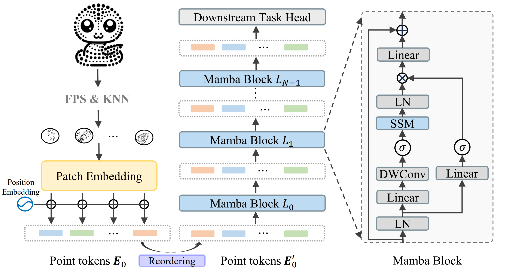
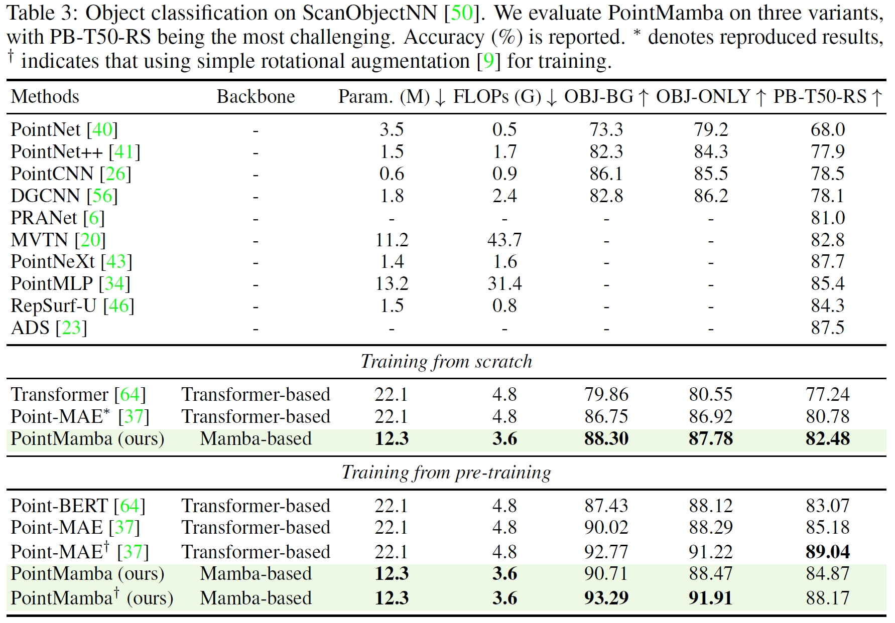

<div  align="center">    
 
</div>


<div align="center">
<h1>PointMamba</h1>
<h3>A Simple State Space Model for Point Cloud Analysis</h3>


[Dingkang Liang](https://dk-liang.github.io/)<sup>1</sup> \*, [Xin Zhou](https://lmd0311.github.io/)<sup>1</sup> \*, [Wei Xu](https://scholar.google.com/citations?user=oMvFn0wAAAAJ&hl=en)<sup>1</sup>, [Xingkui Zhu](https://scholar.google.com/citations?user=wKKiNQkAAAAJ&hl=en)<sup>1</sup>, [Zhikang Zou](https://bigteacher-777.github.io/)<sup>2</sup>, [Xiaoqing Ye](https://shuluoshu.github.io/)<sup>2</sup>, [Xiao Tan](https://tanxchong.github.io/)<sup>2</sup> and [Xiang Bai](https://scholar.google.com/citations?user=UeltiQ4AAAAJ&hl=en)<sup>1†</sup>

<sup>1</sup>  Huazhong University of Science & Technology, <sup>2</sup>  Baidu Inc.

(\*) Equal contribution. ($\dagger$) Corresponding author.

[](https://arxiv.org/abs/2402.10739)
[](https://lmd0311.github.io/projects/PointMamba/)
[-blue.svg)](https://zhuanlan.zhihu.com/p/687191399)
[](https://hits.seeyoufarm.com)
[](https://github.com/LMD0311/PointMamba/issues?q=is%3Aissue+is%3Aclosed) 
[](https://github.com/tatsu-lab/stanford_alpaca/blob/main/LICENSE)

</div>

## 📣 News

- **[26/Sept/2024]** PointMamba is accepted to **NeurIPS 2024**! 🥳🥳🥳
- **[30/May/2024]** **Update!** We update the architecture and performance. Please check our **latest paper** and compare it with the **new results**. **Code and weight will be updated soon**.
- **[01/Apr/2024]** ScanObjectNN with further data augmentation is now available, check it out!
- **[16/Mar/2024]** The configurations and checkpoints for ModelNet40 are now accessible, check it out!
- **[05/Mar/2024]** Our paper **DAPT ([github](https://github.com/LMD0311/DAPT))** has been accepted by **CVPR 2024**! 🥳🥳🥳 Check it out and give it a star 🌟!
- **[16/Feb/2024]** Release the [paper](https://arxiv.org/abs/2402.10739).

## Abstract

Transformers have become one of the foundational architectures in point cloud analysis tasks due to their excellent global modeling ability. However, the attention mechanism has quadratic complexity, making the design of a linear complexity method with global modeling appealing. In this paper, we propose **PointMamba**, transferring the success of Mamba, a recent representative state space model (SSM), from NLP to point cloud analysis tasks. Unlike traditional Transformers, **PointMamba** employs a linear complexity algorithm, presenting global modeling capacity while significantly reducing computational costs. Specifically, our method leverages space-filling curves for effective point tokenization and adopts an extremely simple, non-hierarchical Mamba encoder as the backbone. Comprehensive evaluations demonstrate that **PointMamba** achieves superior performance across multiple datasets while significantly reducing GPU memory usage and FLOPs. This work underscores the potential of SSMs in 3D vision-related tasks and presents a simple yet effective Mamba-based baseline for future research.

## Overview

<div  align="center">    
 
</div>


## Main Results

<div  align="center">    
 
</div>

- The table below will be updated once the code for the latest version release is ready.

| Task | Dataset | Config | Acc.(Scratch) | Download (Scratch) | Acc.(pretrain) | Download (Finetune) |
| :---- | :---- | :---- | :---- | :---- | :---- | :---- |
| Pre-training | ShapeNet | [pretrain.yaml](./cfgs/pretrain.yaml) |  |                                                              | N.A. | [here](https://github.com/LMD0311/PointMamba/releases/download/ckpts/pretrain.pth) |
| Classification | ModelNet40 | [finetune_modelnet.yaml](./cfgs/finetune_modelnet.yaml) | 92.4% | [here](https://github.com/LMD0311/PointMamba/releases/download/ckpts/modelnet_scratch.pth) | 93.6% | [here](https://github.com/LMD0311/PointMamba/releases/download/ckpts/modelnet_pretrain.pth) |
| Classification | ScanObjectNN | [finetune_scan_objbg.yaml](./cfgs/finetune_scan_objbg.yaml) | 88.30% | [here](https://github.com/LMD0311/PointMamba/releases/download/ckpts/scan_objbg_scratch.pth) | 90.71% | [here](https://github.com/LMD0311/PointMamba/releases/download/ckpts/scan_objbg_pretrain.pth) |
| Classification* | ScanObjectNN | [finetune_scan_objbg.yaml](./cfgs/finetune_scan_objbg.yaml) | \ | \ | 93.29% | [here](https://github.com/LMD0311/PointMamba/releases/download/ckpts/scan_objbg_pretrain2.pth) |
| Classification | ScanObjectNN | [finetune_scan_objonly.yaml](./cfgs/finetune_scan_objonly.yaml) | 87.78% | [here](https://github.com/LMD0311/PointMamba/releases/download/ckpts/scan_objonly_scratch.pth) | 88.47% | [here](https://github.com/LMD0311/PointMamba/releases/download/ckpts/scan_objonly_pretrain.pth) |
| Classification* | ScanObjectNN | [finetune_scan_objonly.yaml](./cfgs/finetune_scan_objonly.yaml) | \ | \ | 91.91% | [here](https://github.com/LMD0311/PointMamba/releases/download/ckpts/scan_objonly_pretrain2.pth) |
| Classification | ScanObjectNN | [finetune_scan_hardest.yaml](./cfgs/finetune_scan_hardest.yaml) | 82.48% | [here](https://github.com/LMD0311/PointMamba/releases/download/ckpts/scan_hardest_scratch.pth) | 84.87% | [here](https://github.com/LMD0311/PointMamba/releases/download/ckpts/scan_hardest_pretrain.pth) |
| Classification* | ScanObjectNN | [finetune_scan_hardest.yaml](./cfgs/finetune_scan_hardest.yaml) | \ | \ | 88.17% | [here](https://github.com/LMD0311/PointMamba/releases/download/ckpts/scan_hardest_pretrain2.pth) |
| Part Segmentation | ShapeNetPart | [part segmentation](./part_segmentation) | 85.8% mIoU | [here](https://github.com/LMD0311/PointMamba/releases/download/ckpts/part_seg_scratch.pth) | 86.0% mIoU | [here](https://github.com/LMD0311/PointMamba/releases/download/ckpts/part_seg_pretrain.pth) |

> \* indicates further using simple rotational augmentation for training.

## Getting Started

### Datasets

See [DATASET.md](./DATASET.md) for details.

### Usage

See [USAGE.md](./USAGE.md) for details.

## To Do

- [x] Release code.
- [x] Release checkpoints.
- [x] ModelNet40.
- [ ] Update the code.

## Acknowledgement

This project is based on Point-BERT ([paper](https://arxiv.org/abs/2111.14819), [code](https://github.com/lulutang0608/Point-BERT?tab=readme-ov-file)), Point-MAE ([paper](https://arxiv.org/abs/2203.06604), [code](https://github.com/Pang-Yatian/Point-MAE)), Mamba ([paper](https://arxiv.org/abs/2312.00752), [code](https://github.com/state-spaces/mamba)), Causal-Conv1d ([code](https://github.com/Dao-AILab/causal-conv1d)). Thanks for their wonderful works.

## Citation

If you find this repository useful in your research, please consider giving a star ⭐ and a citation
```bibtex
@article{liang2024pointmamba,
      title={PointMamba: A Simple State Space Model for Point Cloud Analysis}, 
      author={Dingkang Liang and Xin Zhou and Wei Xu and Xingkui Zhu and Zhikang Zou and Xiaoqing Ye and Xiao Tan and Xiang Bai},
      journal={arXiv preprint arXiv:2402.10739},
      year={2024}
}
```
