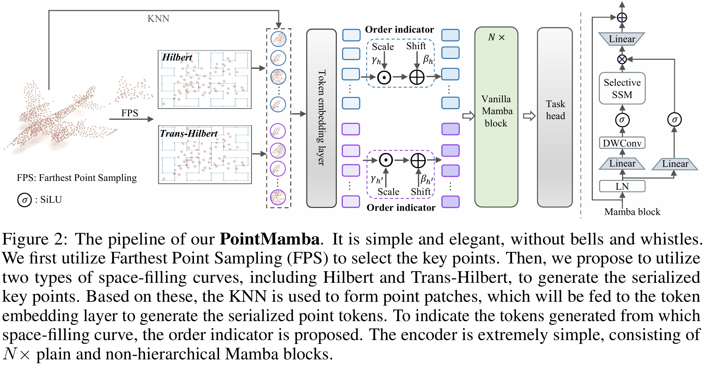

<div  align="center">    
 
</div>


<div align="center">
<h1>PointMamba</h1>
<h3>A Simple State Space Model for Point Cloud Analysis</h3>


[Dingkang Liang](https://dk-liang.github.io/)<sup>1</sup> \*, [Xin Zhou](https://github.com/LMD0311)<sup>1</sup> \*, [Xinyu Wang](https://github.com/deepinact)<sup>1</sup> \*, [Xingkui Zhu](https://scholar.google.com/citations?user=wKKiNQkAAAAJ&hl=en)<sup>1</sup> , [Wei Xu](https://scholar.google.com/citations?user=oMvFn0wAAAAJ&hl=en)<sup>1</sup>, [Zhikang Zou](https://bigteacher-777.github.io/)<sup>2</sup>, [Xiaoqing Ye](https://shuluoshu.github.io/)<sup>2</sup>, and [Xiang Bai](https://scholar.google.com/citations?user=UeltiQ4AAAAJ&hl=en)<sup>1</sup>

<sup>1</sup>  Huazhong University of Science & Technology, <sup>2</sup>  Baidu Inc.

(\*) equal contribution

[](https://arxiv.org/abs/2402.10739)
[](https://zhuanlan.zhihu.com/p/687191399)
[](https://hits.seeyoufarm.com)
[](https://github.com/LMD0311/PointMamba/issues?q=is%3Aopen+is%3Aissue)
[](https://github.com/LMD0311/PointMamba/issues?q=is%3Aissue+is%3Aclosed) 
[](https://github.com/tatsu-lab/stanford_alpaca/blob/main/LICENSE)

</div>

## 📣 News

- **[16/Mar/2024]** The configurations and checkpoints for ModelNet40 are now accessible, check it out!
- **[05/Mar/2024]** Our paper **DAPT ([github](https://github.com/LMD0311/DAPT))** has been accepted by **CVPR 2024**! 🥳🥳🥳 Check it out and give it a star 🌟!

## Abstract

Transformers have become one of the foundational architectures in point cloud analysis tasks due to their excellent global modeling ability. However, the attention mechanism has quadratic complexity and is difficult to extend to long sequence modeling due to limited computational resources and so on. Recently, state space models (SSM), a new family of deep sequence models, have presented great potential for sequence modeling in NLP tasks. In this paper, taking inspiration from the success of SSM in NLP, we propose PointMamba, a framework with global modeling and linear complexity. Specifically, by taking embedded point patches as input, we proposed a reordering strategy to enhance SSM's global modeling ability by providing a more logical geometric scanning order. The reordered point tokens are then sent to a series of Mamba blocks to causally capture the point cloud structure. Experimental results show our proposed PointMamba outperforms the transformer-based counterparts on different point cloud analysis datasets, while significantly saving about 44.3% parameters and 25% FLOPs, demonstrating the potential option for constructing foundational 3D vision models. We hope our PointMamba can provide a new perspective for point cloud analysis.

## Overview

<div  align="center">    
 
</div>


## Main Results

| Task | Dataset | Config | Acc.(Scratch) | Download (Scratch) | Acc.(pre-train) | Download (Fine-tune) |
| :---- | :---- | :---- | :---- | :---- | :---- | :---- |
| Pre-training | ShapeNet | [pretrain.yaml](./cfgs/pretrain.yaml) |  |                                                              | N.A. | [here](https://github.com/LMD0311/PointMamba/releases/download/ckpts/pretrain.pth) |
| Classification | ModelNet40 | [finetune_modelnet.yaml](./cfgs/finetune_modelnet.yaml) | 92.4% | [here](https://github.com/LMD0311/PointMamba/releases/download/ckpts/modelnet_scratch.pth) | 93.6% | [here](https://github.com/LMD0311/PointMamba/releases/download/ckpts/modelnet_pretrain.pth) |
| Classification | ScanObjectNN | [finetune_scan_objbg.yaml](./cfgs/finetune_scan_objbg.yaml) | 88.30% | [here](https://github.com/LMD0311/PointMamba/releases/download/ckpts/scan_objbg_scratch.pth) | 90.71% | [here](https://github.com/LMD0311/PointMamba/releases/download/ckpts/scan_objbg_pretrain.pth) |
| Classification | ScanObjectNN | [finetune_scan_objonly.yaml](./cfgs/finetune_scan_objonly.yaml) | 87.78% | [here](https://github.com/LMD0311/PointMamba/releases/download/ckpts/scan_objonly_scratch.pth) | 88.47% | [here](https://github.com/LMD0311/PointMamba/releases/download/ckpts/scan_objonly_pretrain.pth) |
| Classification | ScanObjectNN | [finetune_scan_hardest.yaml](./cfgs/finetune_scan_hardest.yaml) | 82.48% | [here](https://github.com/LMD0311/PointMamba/releases/download/ckpts/scan_hardest_scratch.pth) | 84.87% | [here](https://github.com/LMD0311/PointMamba/releases/download/ckpts/scan_hardest_pretrain.pth) |
| Part Segmentation | ShapeNetPart | [part segmentation](./part_segmentation) | 85.8% mIoU | [here](https://github.com/LMD0311/PointMamba/releases/download/ckpts/part_seg_scratch.pth) | 86.0% mIoU | [here](https://github.com/LMD0311/PointMamba/releases/download/ckpts/part_seg_pretrain.pth) |

## Getting Started

### Environment

This codebase was tested with the following environment configurations. It may work with other versions.
- Ubuntu 20.04
- CUDA 11.7
- Python 3.9
- PyTorch 1.13.1 + cu117

### Installation

We recommend using Anaconda for the installation process:
```shell
# Create virtual env and install PyTorch
$ conda create -n pointmamba python=3.9
$ conda activate pointmamba
(pointmamba) $ pip install torch==1.13.1+cu117 torchvision==0.14.1+cu117 torchaudio==0.13.1 --extra-index-url https://download.pytorch.org/whl/cu117

# Install basic required packages
(pointmamba) $ pip install -r requirements.txt

# Chamfer Distance & emd
(pointmamba) $ cd ./extensions/chamfer_dist && python setup.py install --user
(pointmamba) $ cd ./extensions/emd && python setup.py install --user

# PointNet++
(pointmamba) $ pip install "git+https://github.com/erikwijmans/Pointnet2_PyTorch.git#egg=pointnet2_ops&subdirectory=pointnet2_ops_lib"

# GPU kNN
(pointmamba) $ pip install --upgrade https://github.com/unlimblue/KNN_CUDA/releases/download/0.2/KNN_CUDA-0.2-py3-none-any.whl

# Mamba
(pointmamba) $ pip install causal-conv1d==1.1.1
(pointmamba) $ pip install mamba-ssm==1.1.1
```

### Datasets

See [DATASET.md](./DATASET.md) for details.

### Usage

#### Pre-train

```
CUDA_VISIBLE_DEVICES=<GPU> python main.py --config cfgs/pretrain.yaml --exp_name <name>
```
#### Classification on ModelNet40

Training from scratch.
```
CUDA_VISIBLE_DEVICES=<GPU> python main.py --scratch_model --config cfgs/finetune_modelnet.yaml --exp_name <name>
```
Training from pre-training.
```
CUDA_VISIBLE_DEVICES=<GPU> python main.py --finetune_model --config cfgs/finetune_modelnet.yaml --ckpts <path/to/pre-trained/model> --exp_name <name>
```

#### Classification on ScanObjectNN

Training from scratch.
```
CUDA_VISIBLE_DEVICES=<GPU> python main.py --scratch_model --config cfgs/finetune_scan_objbg.yaml --exp_name <name>
```
Training from pre-training.
```
CUDA_VISIBLE_DEVICES=<GPU> python main.py --finetune_model --config cfgs/finetune_scan_objbg.yaml --ckpts <path/to/pre-trained/model> --exp_name <name>
```

#### Part Segmentation on ShapeNetPart

Training from scratch.
```
cd part_segmentation
CUDA_VISIBLE_DEVICES=<GPU> python main.py --config cfgs/config.yaml --log_dir <name>
```
Training from pre-training.
```
cd part_segmentation
CUDA_VISIBLE_DEVICES=<GPU> python main.py --config cfgs/config.yaml --ckpts <path/to/pre-trained/model> --log_dir <name>
```
## To Do
- [x] Release code.
- [x] Release checkpoints.
- [x] ModelNet40.
- [ ] Semantic segmentation.
## Acknowledgement

This project is based on Point-BERT ([paper](https://arxiv.org/abs/2111.14819), [code](https://github.com/lulutang0608/Point-BERT?tab=readme-ov-file)), Point-MAE ([paper](https://arxiv.org/abs/2203.06604), [code](https://github.com/Pang-Yatian/Point-MAE)), Mamba ([paper](https://arxiv.org/abs/2312.00752), [code](https://github.com/state-spaces/mamba)), Causal-Conv1d ([code](https://github.com/Dao-AILab/causal-conv1d)). Thanks for their wonderful works.

## Citation

If you find this repository useful in your research, please consider giving a star ⭐ and a citation
```bibtex
@article{liang2024pointmamba,
      title={PointMamba: A Simple State Space Model for Point Cloud Analysis}, 
      author={Dingkang Liang and Xin Zhou and Xinyu Wang and Xingkui Zhu and Wei Xu and Zhikang Zou and Xiaoqing Ye and Xiang Bai},
      journal={arXiv preprint arXiv:2402.10739},
      year={2024}
}
```
